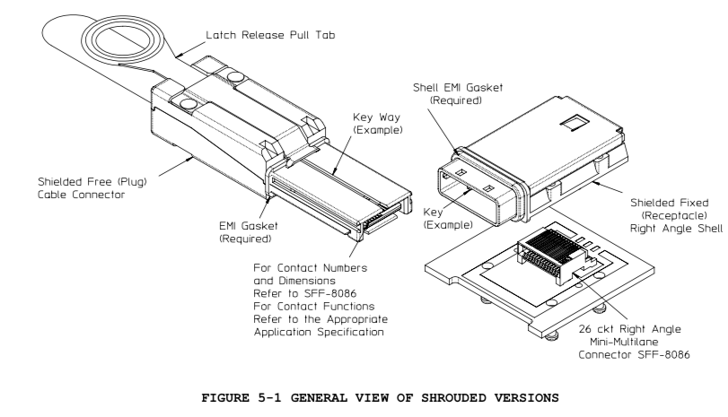

# SNIA SFF

[SFF Specifications](https://www.snia.org/technology-communities/sff/specifications)

| No          | Title                                                        | Type       |
|-------------|--------------------------------------------------------------|------------|
| SFF-TA-1001 | Universal x4 Link Definition for SFF-8639 (a.k.a: U.2?)      |            |

| No       | Title                                                        | Type       |
|----------|--------------------------------------------------------------|------------|
| SFF-9402 | Multi-Protocol Internal Cable Pinouts for SAS and/or PCIe    |            |
| SFF-8654 | 0.6mm 4/8X Unshielded I/O Connector                          |            |
| SFF-8644 | Mini Multilane 4/8X 12 Gb/s Shielded Cage/Connector (HD12sh) | Assembly   |
| SFF-8643 | Mini Multilane 4/8X 12 Gb/s Unshielded Connector (HD12un)    | Assembly   |
| SFF-8639 | Multifunction 6X Unshielded Connector (a.k.a. U.2            | Assembly   |
| SFF-8621 | MiniLink 4/8X 24 Gb/s Interconnect Solution                  |            |
| SFF-8614 | Mini Multilane 4/8X Shielded Cage/Connector (HDsh)           | Mechanical |
| SFF-8613 | Mini Multilane 4/8X Unshielded Connector (HDun)              | Mechanical |
| SFF-8612 | MiniLink 4/8X Shielded Connector                             | Mechanical |
| SFF-8611 | MiniLink 4/8X I/O Cable Assemblies                           | Mechanical |
| SFF-8087 | Mini Multilane 4X Unshielded Connector Shell and Plug        | Mechanical |
| SFF-8088 | Mini Multilane 4X Shielded Connector Shell and Plug          | Mechanical |

## SFF-TA-1001

* [SFF-TA-1001](https://members.snia.org/document/dl/26900)

## SFF-9402

* [SFF-9402 Rev 1.1](https://members.snia.org/document/dl/27380)

## SFF-8654

* [SFF-8654 Rev 1.2](https://members.snia.org/document/dl/26744)

## SFF-8644

* [SFF-8644 Rev 3.5](https://members.snia.org/document/dl/25952)

## SFF-8643

* [SFF-8643 Rev 3.5](https://members.snia.org/document/dl/25951)

## SFF-8639

* [SFF-8639 Rev 2.1](https://members.snia.org/document/dl/26489)

## SFF-8621

* [SFF-8621 Rev 0.3(Draft)](https://members.snia.org/document/dl/25940)

## SFF-8614

* [SFF-8614 Rev 3.4](https://members.snia.org/document/dl/25939)

## SFF-8613

* [SFF-8613 Rev 3.5](https://members.snia.org/document/dl/25938)

## SFF-8612

* [SFF-8612 Rev 0.9.2(Draft)](https://members.snia.org/document/dl/26705)

## SFF-8611

* [MiniLink 4/8X I/O Cable Assemblies](https://members.snia.org/document/dl/27937)

## SFF-8088

* [SFF-8088 Rev 3.4](https://members.snia.org/document/dl/25824)

## SFF-8087

* [SFF-8087 Rev 2.6](https://members.snia.org/document/dl/25823)
*

